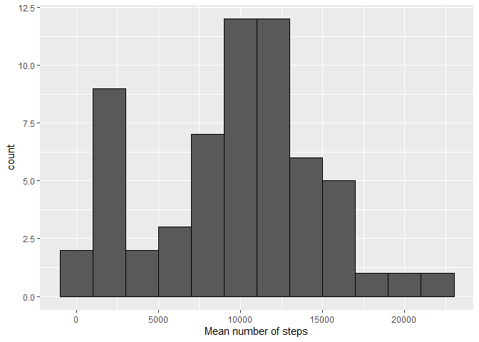
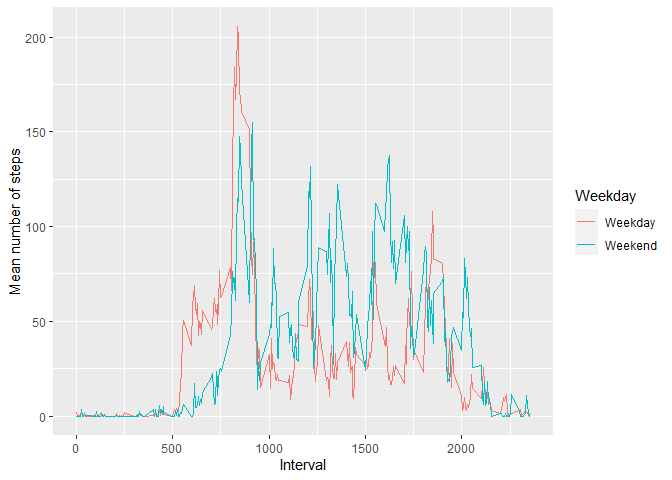

# Packages 

```r
library(tidyverse)
```
# Loading and preprocessing the data
The data set, called __*activity.csv*__, comes in a *Winrar* file, I extracted it and the data was saved in a new file called __*activity*__.

### Raw data


```r
Walking <- 
  read.csv(file = 'activity/activity.csv')

head(Walking, 3)
```

```
##   steps       date interval
## 1    NA 2012-10-01        0
## 2    NA 2012-10-01        5
## 3    NA 2012-10-01       10
```

### Summary by Day
Ignoring the missing values, I created two data sets: 

  * **Day_step**, where groups were made based on the date.
  
  * **Interval_step**, where groups were made based on the 5-minutes intervals.


```r
Day_step <-  Walking %>% 
               group_by(date) %>% 
                  summarise(Total = sum(steps, na.rm = TRUE))

head(Day_step,3)
```

```
## # A tibble: 3 x 2
##   date       Total
##   <chr>      <int>
## 1 2012-10-01     0
## 2 2012-10-02   126
## 3 2012-10-03 11352
```

```r
Interval_step <-  Walking %>% 
                    group_by(interval) %>% 
                      summarise(Mean = mean(steps, na.rm = TRUE))
head(Interval_step,3)
```

```
## # A tibble: 3 x 2
##   interval  Mean
##      <int> <dbl>
## 1        0 1.72 
## 2        5 0.340
## 3       10 0.132
```
## What is mean total number of steps taken per day?

```r
Day_plot <- ggplot(data = Day_step)

Day_plot + 
  geom_histogram(aes(x = Total), color = 'black', binwidth = 2000) +
    xlab('Mean number of steps')
```

<!-- -->

## What is the average daily activity pattern?

```r
ggplot(data = Interval_step) +
  geom_line(aes(x =interval, y = Mean)) +
    ylab('Mean number of steps') + xlab('Interval')
```

<!-- -->

The interval with the **maximum** mean number of steps is: **2355** 


## Imputing missing values

There are **2304** rows with missing values. I decided to fill the missing values with the median of that interval. 

```r
Day_step_No_NA <-  
  Walking %>%     
      group_by(interval) %>% 
          mutate(steps = ifelse(is.na(steps), median(steps, na.rm = TRUE),                     steps)) 

Day_step_No_NA
```

```
## # A tibble: 17,568 x 3
## # Groups:   interval [288]
##    steps date       interval
##    <int> <chr>         <int>
##  1     0 2012-10-01        0
##  2     0 2012-10-01        5
##  3     0 2012-10-01       10
##  4     0 2012-10-01       15
##  5     0 2012-10-01       20
##  6     0 2012-10-01       25
##  7     0 2012-10-01       30
##  8     0 2012-10-01       35
##  9     0 2012-10-01       40
## 10     0 2012-10-01       45
## # ... with 17,558 more rows
```


```r
Day_step_No_NA %>%
  group_by(date) %>% 
      summarise(Total = sum(steps)) %>%
          ggplot(aes(x = Total)) + 
              geom_histogram(color = 'black', binwidth = 2000) +
              xlab('Mean number of steps')
```

<!-- -->

```
## Warning: Unknown or uninitialised column: `steps`.
```

```
## Warning in mean.default(Day_step$steps, na.rm = TRUE): argument is not numeric
## or logical: returning NA
```

```
## Warning: Unknown or uninitialised column: `steps`.
```
  * The new **mean** number of steps is: **32.9995446**
  * The new **median** number of steps is: **0**


## Are there differences in activity patterns between weekdays and weekends?


```r
Day_step_Week <-
  Day_step_No_NA %>%
    mutate(Weekday = ifelse(
      (weekdays(as.Date(date)) == "Saturday")|(weekdays(as.Date(date)) == "Sunday"), 'Weekend', 'Weekday'))

head(Day_step_Week, 3)
```

```
## # A tibble: 3 x 4
## # Groups:   interval [3]
##   steps date       interval Weekday
##   <int> <chr>         <int> <chr>  
## 1     0 2012-10-01        0 Weekday
## 2     0 2012-10-01        5 Weekday
## 3     0 2012-10-01       10 Weekday
```

```r
Day_step_Week %>%
  group_by(interval, Weekday) %>%
    summarize(Mean = mean(steps)) %>%
        ggplot() +
            geom_line(aes(x =interval, y = Mean, color = Weekday)) +
            ylab('Mean number of steps') + xlab('Interval')
```

<!-- -->
